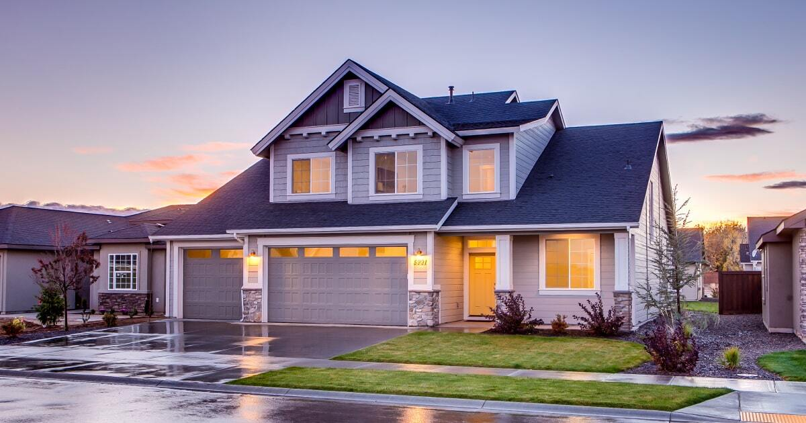
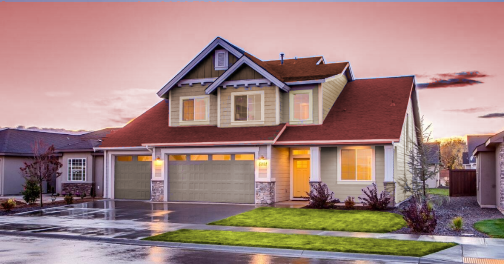

# Paint Anything


Change the color of anything with easy object selection using the novel [Segment Anything Model](https://github.com/facebookresearch/segment-anything) (SAM) through a web interface built with [React](https://react.dev/) and a [FastAPI](https://fastapi.tiangolo.com/) backend.

Follow these steps:

- 🆙 Upload any image.
- 🟢 Left click any part of the image to include it in your colouring.
- 🔴 Right click any part of the image to ignore it.
- 🎚️Change hue, saturation and lightness as you wish.

https://github.com/alexbondino/paint-anything/assets/53621362/feb94a04-386b-4f65-a732-fd00eafbea6b

Some other examples of what can be achieved in under 5 minutes per image are shown below

|              Original               |               Color Changed               |
| :---------------------------------: | :---------------------------------------: |
|  |  |
|               |           |
|             |              |


__This project is an open-source work in progress. Feel free to raise any issues!__

- [Paint Anything](#paint-anything)
  - [🔧 Setup](#-setup)
    - [GPU Support](#gpu-support)
  - [🏗️ Building the App](#️-building-the-app)
  - [🖌️ Running the app](#️-running-the-app)
  - [License](#license)


## 🔧 Setup

This project requires `python >= 3.8` and `Node.js 18` to work properly. We recommend using **python 3.10** and **Node.js 18.16**. If you don't have python in your computer, you can install it from [here](https://www.python.org/downloads/release/python-3100/). Likewise, Node.js can be installed by following the instructions [here](https://nodejs.org/).

Clone this repo and open it

```bash
git clone https://github.com/alexbondino/imagine-houses.git
cd imagine-houses
```

Download the SAM files (including ONNX decoders) from this [google drive](https://drive.google.com/drive/folders/1JVL1oGfZWsSuO4RpmSOw2UKkNObsnVtn?usp=drive_link) and unzip them into`web-page/backend/app/assets`. Your assets folder should now look like this:

```python
── assets
   ├── sam_vit_b_01ec64.pth # base SAM model
   ├── sam_vit_l_0b3195.pth # large SAM model
   ├── sam_vit_h_4b8939.pth # huge SAM model
   ├── vit_b_quantized.onnx # base model ONNX mask decoder
   ├── vit_l_quantized.onnx # large model ONNX mask decoder
   └── vit_h_quantized.onnx # huge model ONNX mask decoder
```

### GPU Support

The initial image processing can be greatly accelerated with a GPU with enough vram. We have set a minimum requirement of **2Gb**, **6Gb** and **11Gb** for the base, large and huge model, respectively. If your computer has a GPU and you try to run a model that exceeds the available vram, it will instead be processed in the CPU.

We provide GPU support for NVIDIA graphics cards that allow `cuda >= 11.7`, but you can change the [requirements](web-page/backend/app/requirements.txt) with a version of torch and cuda of your choice. As recommended in the [SAM repo](https://github.com/facebookresearch/segment-anything) instructions, be sure to use `pytorch>=1.7` and `torchvision>=0.8`.

## 🏗️ Building the App

__Step 1:__ Inside your repo, head to `web-page/frontend` and install JS packages using `npm` (packaged along with NodeJS):

```bash
cd web-page/frontend
npm install
```

__Step 2:__ Create a production build

```bash
npm run build
```
The previous commands should install and setup all necessary packages to run the project.

## 🖌️ Running the app

Now the fun starts! Run the app with the following command:

```bash
npm run serve
```

The previous command will simultaneously spin-up the FastAPI backend at port 8000 and launch the React web-app at port 3000. A new browser window should be automatically opened with the application, but you can also access it by heading to [localhost:3000](localhost:3000)

## License

This project is licensed under the [**MIT License**](LICENSE).
